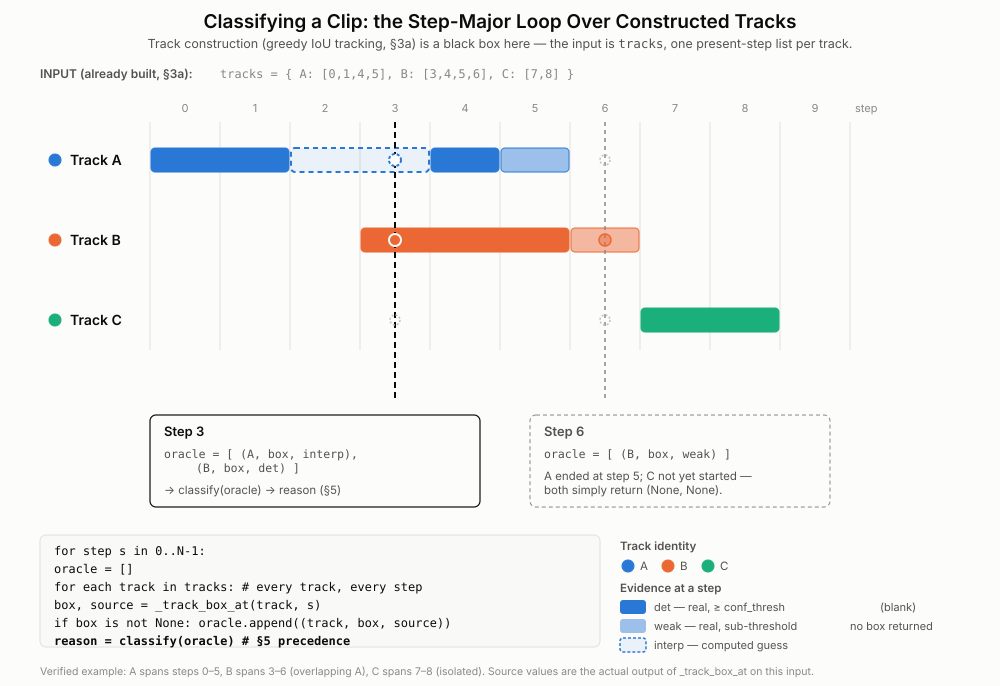

- [Mining algorithm \& rationale](#mining-algorithm--rationale)
  - [1. Objective (why the design is shaped this way)](#1-objective-why-the-design-is-shaped-this-way)
    - [1a. Scope: the raw detector, not the deployed system — and the resulting cost model](#1a-scope-the-raw-detector-not-the-deployed-system--and-the-resulting-cost-model)
  - [2. Two views of every frame](#2-two-views-of-every-frame)
    - [2a. Two orthogonal axes: P/N (result) vs T/F (truth)](#2a-two-orthogonal-axes-pn-result-vs-tf-truth)
  - [3. Pipeline](#3-pipeline)
    - [3a. Tracking (`_build_tracks`)](#3a-tracking-_build_tracks)
    - [3b. Box at a step (`_track_box_at`)](#3b-box-at-a-step-_track_box_at)
    - [3c. Worked example — one person, detection sequence → categories](#3c-worked-example--one-person-detection-sequence--categories)
  - [4. Anchors (the crux)](#4-anchors-the-crux)
    - [4a. How much work `_bridgeable` can do: the feasible band of its two tests](#4a-how-much-work-_bridgeable-can-do-the-feasible-band-of-its-two-tests)
    - [Worked example — intermixed detections (`P` = detected, `N` = none)](#worked-example--intermixed-detections-p--detected-n--none)
  - [5. Category taxonomy](#5-category-taxonomy)
    - [Selection: independent per-category coverage guarantees](#selection-independent-per-category-coverage-guarantees)
    - [Multiple people per frame](#multiple-people-per-frame)
    - [Track ids and clip ids](#track-ids-and-clip-ids)
  - [6. Static false positives (`SFP`) — `_static_fp_tids`](#6-static-false-positives-sfp--_static_fp_tids)
    - [6a. Two different predicates: flagging vs. accumulating evidence](#6a-two-different-predicates-flagging-vs-accumulating-evidence)
    - [6b. What the persistence map's stored value means](#6b-what-the-persistence-maps-stored-value-means)
  - [7. What the miner cannot decide (limits \& multi-person)](#7-what-the-miner-cannot-decide-limits--multi-person)
  - [8. Config knobs that change classification](#8-config-knobs-that-change-classification)
  - [9. Task ordering in `tasks_*.json`](#9-task-ordering-in-tasks_json)


# Mining algorithm & rationale

Detailed spec for how `flicker_miner.py` turns a clip into per-frame **categories**
(`Intp_FN` / `Weak_FN` / `Anchor_start` / `Anchor_end` / `SFP` / `FP` / `easy`) — a
frame independently belongs to any number of these at once, not one winning
label — and *why* it is built this way. The [README](README.md) is the
operational guide; this file is the reference for the classification logic.
Symbols in `code font` are the actual config keys / functions.

---

## 1. Objective (why the design is shaped this way)

The goal is **not** to auto-label footage. It is to accelerate human review by
producing *almost-correct* pre-labels — cheap for a reviewer to correct rather than
draw from scratch — that **keep most frames whose detection pattern *looks like* a
model error (flicker gaps, weak detections, brief or static blips) and only a thin
sample of ordinary frames**, so a reviewer's effort lands on candidate misses and
false positives, which review confirms or rejects before they feed retraining.
Nothing the miner outputs is treated as ground truth; every decision below exists
to select a frame as a candidate for human review, not to assert truth.

**The detector doing the mining is the same detector the mined data will retrain.**
Every threshold and view in this pipeline (§2) is evaluated on the exact deployed
model under test (`yolo11x_set01-0148.pt`) — not a stand-in, and not a different,
bigger model. This is a **closed self-improvement loop**: the model's own errors,
once a human confirms them, become that *same* model's next training signal. It
is also why no second, stronger reference model is consulted anywhere in
classification (§7) — mixing in a different detector's blind spots and strengths
would dilute the "this model's own weaknesses" signal the whole retraining loop
depends on. (A planned extension would add optional auditing by independent
reference detector(s) to help the reviewer judge ambiguous candidates — additive
to this loop, not a replacement for its retraining target.)

Consequently the miner never tries to decide *true positive vs. false positive*.
It surfaces **candidates** by structure and thresholds; the human makes the TP/FP
call. This is a deliberate constraint (see [§7](#7-what-the-miner-cannot-decide-limits--multi-person)).

### 1a. Scope: the raw detector, not the deployed system — and the resulting cost model

Two scope decisions govern every threshold in this document. State them
explicitly, because both are easy to misread and both make otherwise-alarming
behaviour correct.

**Scope decision 1 — the optimisation target is the raw detector.** The deployed
service does not report a person the moment the network emits a box above
`conf_thresh`. `spacenorm_obj_detection.py` applies four further stages in
sequence: `filter_small_objects` (drop boxes below a pixel-area ratio),
`remove_outside_ROI` (mask to a per-camera polygon), `check_bb_on_background`
(MOG2 motion test) and `hysteresis` (require *N* consecutive reporting frames).
The mining pipeline models **none** of them. What §2 calls the *production view*
is therefore exactly one thing: **the raw detector's output above
`conf_thresh`** — not the set of events the field reports.

This is intended. The artifact produced by the review loop is a training set, and
training changes only the network's weights; it cannot change an ROI polygon or a
MOG2 threshold. Mining errors introduced *downstream* of the network would
produce examples that no amount of retraining could fix. Restricting the target
to the detector keeps every mined example actionable.

The cost of the restriction is a defined blind spot: an error the detector does
not make, but the surrounding system does, is invisible here. If MOG2 or the ROI
mask suppresses a correct detection, the miner sees a `strong` box, hypothesises
nothing, and files the frame as `easy`. Such frames are genuine end-to-end false
negatives of the deployed system and are **out of scope for this project by
construction** — not overlooked. Improving them is a post-processing problem, to
be attacked by tuning those stages, not by retraining.

**Scope decision 2 — recall of candidates dominates precision of pre-labels.**
The output of this pipeline is a review queue, not a labelled dataset. Every
decision is followed by a human who accepts, corrects or deletes it inside Label
Studio. That fixes the cost model, and it is strongly asymmetric:

| miner error | what the reviewer does | cost |
|---|---|---|
| flags a correct detection as a suspected FP | relabels the shown box `person` | one click |
| interpolates a box where no person is | deletes the shown box | one click |
| fails to flag a real error | nothing — the frame never enters the queue | **the example is lost permanently** |

A false candidate costs one interaction on a box the reviewer is already looking
at. A missed candidate costs a training example that no later stage can recover,
because nothing downstream ever revisits an unflagged frame. Wherever a threshold
trades the two against each other, this document therefore chooses recall — and
says so at the point of choice. Concretely this is why `static_min_frames` is
short enough to flag a person who merely paused ([§6](#6-static-false-positives-sfp--_static_fp_tids)),
why the gap-bridge gate is calibrated to reject only an extreme tail
([§4](#4-anchors-the-crux)), and why per-category selection caps may be exceeded
rather than enforced as a shared budget ([§5](#5-category-taxonomy)).

The one place this asymmetry reverses is the **cross-clip persistence map**
([§6](#6-static-false-positives-sfp--_static_fp_tids)), because that map's output
is fed back into later flagging decisions. A false entry there is not corrected
by a reviewer; it propagates. Accumulated evidence is consequently gated by a far
stricter predicate than flagging is.

The patterns it keys on are *candidates*, resolved only at review — the same
pattern can come from a real error **or** a correct detection (formalised on the
P/N vs T/F axes in §2a):

| detection pattern | category it produces | consistent with (suspected) | but could instead be |
|---|---|---|---|
| detected → gap → detected (bridged) | `Intp_FN` (+ anchors) | a person missed during the gap | a flickering FP (the gap fills are then spurious) |
| a sub-threshold *weak* detection | `Weak_FN` | a near-miss the field suppressed | a weak false alarm |
| a 1–2 step high-confidence blip | `FP` | a phantom detection | a real person passing quickly through |
| persistent, stationary, high-confidence | `SFP` | a mannequin / poster / standee | a real person standing still |

---

## 2. Two views of every frame

For each processed frame the miner holds two views of the **same deployed model**
(`yolo11x_set01-0148.pt`, run at production `img_size`):

- **Production view** — detections with conf ≥ `conf_thresh` (0.6). This is the
  **raw detector's** output at the deployed report threshold. It is *not* the set
  of events the deployed service reports: the service applies four further filter
  stages after this threshold, none of which are modelled here — see
  [§1a](#1a-scope-the-raw-detector-not-the-deployed-system--and-the-resulting-cost-model)
  for what that includes and excludes.
- **Recall view** — detections with conf ≥ `track_conf` (0.25). A wider net that
  keeps weak/flickering detections the production view would suppress.

The recall view feeds tracking; the production view is what we test *against*.
The categories a frame is flagged for (§5) mean something only relative to
these two thresholds — they describe the model's own behaviour, not absolute truth
(see §2a).

### 2a. Two orthogonal axes: P/N (result) vs T/F (truth)

Keep two independent ideas separate — conflating them is the main source of
confusion in error-mining vocabulary:

- **Positive / Negative (P/N) — the detection *result*.** **P** = the model output
  a person box; **N** = it output nothing. This is *observed directly* from the
  model. Unless stated otherwise P/N means the **production view** (conf ≥
  `conf_thresh`) — the raw detector at the deployed threshold (§1a). The recall view can turn a
  production-`N` into a weak `P` at the same spot: not a second result, but a
  *clue* that the `N` may be a missed person (a suspected FN) rather than a
  correct nothing — the model fired faintly, just below the report bar.
- **True / False (T/F) — the *truthfulness* of that result against ground truth**
  (here, the human reviewer). **T** = the result matches reality; **F** = it does
  not. This is *not observable by the miner*; establishing it **is** the review
  step (§1, §7).

Crossing the two axes gives the usual 2×2:

| | really a person (GT +) | really nothing (GT −) |
|---|---|---|
| **detected (P)** | TP | **FP** |
| **not detected (N)** | **FN** | TN |

**The miner sees only the P/N axis** (plus recall-view + temporal/structural
clues). It never sees the T/F axis. So every category it emits is *a fact on the
P/N axis* **+ a hypothesis about where an `F` (an error) is likely** — never a
verified `T`/`F`. The `FN`/`FP` inside a category name is therefore **shorthand
for "suspected FN/FP"**, kept short for label ergonomics; the reviewer supplies
the real T/F. (These six categories are independent booleans a frame can hold
any combination of — not mutually exclusive alternatives; see §5.)

| category | production result | miner's hypothesis | reviewer resolves to |
|---|---|---|---|
| `Weak_FN` | **N** (a weak recall `P` the field suppressed) | suspected **FN** — a real person missed | a real positive, or a recall-view FP ⇒ leave as **TN** |
| `Intp_FN` | **N** (`N` in *both* views; person inferred structurally) | suspected **FN**, filled by interpolation | a genuine miss, or spurious (anchors were FP) |
| `FP` | **P** (transient track) | suspected **FP** (phantom) | a real person (**TP**), or delete as **FP** |
| `SFP` | **P** (persistent, static) | suspected **FP** (apparatus) | mannequin ⇒ hard negative (**FP**), or a real still person (**TP**) |
| `Anchor_start` / `_end` | **P** (a strong detection bordering a gap) | *no* truth claim — "please check this `P`" | **TP** or **FP**, reviewer decides |
| `easy` | `P` or `N`, as expected | *no* error hypothesised | usually **T** (model/field agree) |

Note the two `FN` categories differ in their P/N clue: `Weak_FN` has a weak `P` in the
recall view, whereas `Intp_FN` is `N` in **both** views and the person is inferred
purely from temporal structure (interpolation).

---

## 3. Pipeline

```
clip.mp4
  └─ pass 1 (every track_vid_stride-th frame):
       run deployed model @ track_conf  ─►  per-frame person/animal detections (+ tiny gray crop per person for static FP mining using ZNCC)
  ├─ greedy-IoU tracker, once — after pass 1 finishes: person tracks across the whole clip (gap-bridged ≤ max_gap_frames)
  ├─ per track, precomputed once: find anchor steps (§4); test for static-FP (§6)
  ├─ per frame: tally its independent category counts (§5) using the two views + track topology
  │             (a gap step's box is interpolated on demand here, §3b — not precomputed)
  ├─ select frames (independent per-category caps, §5)
  └─ pass 2: re-decode only the selected frames for their images

mine_clip() returns here — the rest happens in build_dataset.py's sweep(), per selected frame:
  └─ build pre-labels (.jpg + YOLO .txt) + a Label Studio task
```

Only pass-1 *metadata* is kept in memory (boxes + a 32×64 gray crop per detection),
so a 24 h sweep stays memory-light.

**Terminology: what is a "track"?** A **track** (`tid` in code) is the tracker's
*hypothesis* that a sequence of detections across different processed steps are
the **same physical object** — one key-value pair in the dict `_build_tracks`
returns: the key is `tid`, a small integer identifying the object; the value is
`[(step, detection), ...]`, the ordered list that comprises the track, built by
greedy IoU association (§3a). Call this list **`seq`** — the name it's given
elsewhere in the code (`_track_box_at(seq, s, ...)`, `for tid, seq in
tracks.items():`) and the name used below. Two properties of a track, both
defined on `seq`, are used constantly and are easy to conflate:

- **Span** — the step range from a track's first detected step to its last
  (`seq[0][0]` … `seq[-1][0]`). A track's span may contain one or more gaps (see
  below) — a track need not have a detection at every step inside its span, only
  at its endpoints and whatever else was matched in between.
- **Length** (`len(seq)`, `track_len[tid]`) — the *count* of steps at which the
  track actually has a detection (`strong` or `weak`). This is **not** the same as
  the span: a track with just 2 detections 15 steps apart (bridged across
  the full `max_gap_frames`) has `track_len = 2`, even though its span covers 16
  steps. This matters because `fp_max_track_len` and `static_min_frames` (§5, §6)
  both test **length** (detection count), not span — a track can be "short" by
  this measure while spanning a long stretch of the clip.

A track is a purely geometric identity **hypothesis** from IoU overlap (§3a), not a
guarantee that every detection in it is really the same object. When that
hypothesis is wrong — an ID switch across a gap, or two crossing people merged —
that is exactly the multi-person failure mode discussed in
[§7](#7-what-the-miner-cannot-decide-limits--multi-person).

**Terminology: what is a "gap"?** The word recurs throughout §3–§4, always meaning
the same thing: for one track, **a maximal run of consecutive processed steps with
no detection, bounded on both sides by steps where the tracker actually detected
this same object again** (`strong` or `weak` — §3b). A gap has two separate
consequences, decided by two separate checks:

1. **Does the track survive it at all?** — the tracker's silence time-to-live,
   `max_gap_frames` (§3a). If the gap is longer than this, the two bracketing
   detections are never even considered the same track — there is no gap to fill,
   just two unrelated tracks.
2. **Is the gap filled in?** — for a gap within one track's span, whether the
   interior steps get an interpolated box (`Intp_FN`) and whether the two
   bracketing steps become anchors additionally requires `_bridgeable` (§4), a
   geometric plausibility check on top of the length limit.

**Length convention.** Wherever a gap is compared against `max_gap_frames` (in code
and in this doc), its length is the **step distance between the two bracketing
detected steps** (`q − p`), *not* the count of missing interior steps (`q − p − 1`
— one fewer). E.g. steps 1 and 4 detected, steps 2–3 absent (2 missing frames) ⇒
gap length `= 4 − 1 = 3` — the value actually checked against `max_gap_frames`
(§3c, Example A, step 2).

**Terminology: what is the "classify loop"?** The **classify loop** is the
step-major loop inside `mine_clip` that turns tracked detections into per-frame
category counts — the one loop referenced throughout §3a, §3b, and §5, always
meaning the same thing. For every processed step *s* (one iteration per step,
spanning the *whole* clip), it:

1. Queries **every** track for its box at *s* via `_track_box_at` (§3b), collecting
   the results into that step's `oracle` — one `(tid, box, source)` per track that
   has anything to say about this step.
2. Sorts each `oracle` entry into a category (`Intp_FN`/`Weak_FN`/anchor/suspect)
   based on its `source` and track membership (§4, §5, §6), tagging each box with
   the `tid` it came from.
3. Tallies those into six independent per-frame counts (`n_intpfn`, `n_weakfn`,
   `n_anchor_start`, `n_anchor_end`, `n_fp`, `n_sfp`) and appends a full record to
   `frames` — the per-step annotation for the *whole* clip, independent of
   whatever gets selected afterward (§9). **There is no single winning category
   here** — a frame simply carries whichever counts its boxes produced; §5
   derives the *set* of categories a frame belongs to from these counts on
   demand, rather than collapsing them into one label at classification time.

So "the classify loop" always means this one per-step loop — **not**
`_build_tracks` (§3a, which runs once, *before* this loop even starts) and
**not** `_track_box_at` (§3b, which this loop *calls*, once per candidate track,
at every step it runs).

**A step can belong to many tracks at once — and that's normal, not an
anomaly.** A processed step isn't owned by one track; it's just a moment in time,
and *any* number of tracks (0, 1, or many) can have a valid box there
simultaneously. That is exactly why the classify loop's per-step accumulator,
`oracle`, is a **list** rather than a single value: one entry per track that has
something to say about that step. Any frame with more than one person produces
`oracle` entries from more than one track — the ordinary case, not an edge case.

Two things worth **not** conflating here:

- **Many tracks can share a step** — normal, common, expected (see below).
- **A single detection is never shared across two tracks** — impossible by
  construction: the classify loop's per-step detection→track association is
  one-to-one (§5), so no one detection ever feeds two tracks.

Multiple people in view is the obvious cause. Three less obvious ones also
produce it:

- A real person's track and a **completely different** track's interpolated gap
  (§4) can overlap in time — one track fills in a guessed box via interpolation
  while another has a genuine detection, at the *same* step.
- A persistent static-FP fixture (§6) and a real, transient person can coexist —
  every step the transient person is visible also belongs to the fixture's
  track.
- A transient-FP phantom (§5) and a real person elsewhere in the frame can
  coexist at the same step.

What this does **not** describe: a crossing/occlusion between two people being
merged into "one step, two tracks" via a *shared* detection. If the tracker
confuses two crossing people, the failure mode is an **ID switch** (a detection
wrongly reassigned between identities across time — §7), not a single detection
being double-counted at one instant.

**Figure.** [`figures/classify_loop_overview.svg`](figures/classify_loop_overview.svg)
shows this whole process on a verified, executed 3-track example — including two
tracks overlapping in time (steps 3–5) and the step-major loop's per-step
`oracle` construction. Track construction (§3a) is treated as a black box there,
exactly as it is here.



### 3a. Tracking (`_build_tracks`)

**`_build_tracks` is called once per clip, after pass 1 finishes** — not once per frame. `mine_clip`
first decodes the whole clip, building the complete `step_meta` list (one entry
per processed step), and only then calls `_build_tracks` a single time, handing
it every step's detections at once — there is exactly one call site in the whole
codebase. Internally the function loops over every step itself
(`for s, dets in enumerate(person_steps):`), which makes it easy to mistake for
something invoked per frame from the outside — it isn't: that loop runs inside one
call, over the whole clip's data in a single batch. Contrast this with
`_track_box_at` (§3b), which **is** called many times per clip — once for every
`(track, step)` pair, from inside the classify loop, each time querying the
`tracks` dict this one `_build_tracks` call already produced.

**Person-class only.** `_build_tracks` is called on the `persons` list alone
(`_build_tracks([m["persons"] for m in step_meta], ...)`) — animal detections
(bird/cat/dog/horse/sheep/cow) never enter `_build_tracks`, are never associated
into a track, and get no gap-bridging, anchors, or `Weak_FN`/`Intp_FN` equivalent.
Every track this function produces — and everything read from it via
`_track_box_at` (§3b) — is therefore always a person. See
[§7](#7-what-the-miner-cannot-decide-limits--multi-person) for what this means
for animal detections.

`_build_tracks` keeps **two** data structures across steps — easy to conflate, but
serving different roles:

- **`tracks`** (per-step-**global**) — the dict `tid → [(step, detection), ...]`
  that this function returns. Created once, before the loop starts, it only ever
  grows: by the time step *s* is processed it holds the **complete history** of
  every track hypothesized from step 0 through *s*, including tracks that aged out
  long ago and can never resume. It is a pure accumulating output — nothing is
  ever read back from it during matching.
- **`active`** (per-step-**local**) — the small working set actually consulted for
  matching: for each track still eligible to receive a new detection, only its
  **most recent box** and the step it was last seen. It is pruned and refreshed
  *every* step, so it reflects only the currently-live candidates, never a track's
  full history.

So a new detection is matched against **`active`**, never against the full
`tracks` record — a track that has aged out of `active` is invisible to future
matching even though its history still sits, untouched, inside `tracks`. At every
processed step, in order:

1. **Expire stale tracks from `active`.** Any track silent for more than
   `max_gap_frames` (15) steps is dropped — for good (its record in `tracks`
   remains, just unreachable for future matching). This is the entire mechanism
   behind "gap-bridged ≤ `max_gap_frames`": a dormant track has a time-to-live,
   and a detection appearing after that window starts a brand-new track (a fresh
   `tid` in `tracks`) with no memory of the old one.
2. **Score every (detection, active track) pair by IoU** against that track's
   *last-seen* box (from `active`) — not a predicted one. A detection reappearing
   after *N* silent steps resumes its pre-gap track only if it still spatially
   overlaps (IoU ≥ `iou_track`, 0.3) where that track was last seen.
3. **Assign greedily and globally.** All candidate pairs *this step* — across every
   detection and every active track at once — are pooled, sorted by IoU
   descending, and consumed highest-first, each match locking both sides. This is
   the "greedy" in "greedy-IoU tracker": not the Hungarian algorithm (no
   global-optimum assignment), just "best overlap wins, then the next-best
   remaining overlap wins," in one pass per step.
4. **Unmatched detections start new tracks in `tracks`;** matched or new, the
   detection is appended to `tracks[tid]` and that track's `active` entry is
   refreshed to the box/step just seen, so the IoU test in step 2 always anchors
   to the freshest known position.

**Scope.** Both structures are strictly **per-clip**: `_build_tracks` is called
fresh inside `mine_clip` for each clip, with `tracks = {}` and `tid` numbering
restarting at 0 every time. No track identity or history survives across clip
boundaries — contrast the deliberately **cross-clip** `ChannelPersistence` map
(§6), which is the only state in this system that persists between clips.

This makes it a genuine, if minimal, multi-object tracking (MOT) algorithm — in the
**tracking-by-detection** family, specifically the lineage of the "IOU Tracker"
(Bochinski, Eiselein & Sikora, 2017): pure frame-to-frame spatial overlap, greedily
assigned, with no motion model and no appearance model. For contrast with more
capable trackers: **SORT** adds a Kalman filter, so association is IoU against a
*predicted* position rather than the last-seen one — handling motion during a gap
better; **DeepSORT** adds a learned appearance embedding, so a crossing or brief
occlusion can be resolved by "this looks like the same person," not just box
overlap — exactly the capability this tracker lacks, and the reason for the
residual identity-switch risk noted in [§7](#7-what-the-miner-cannot-decide-limits--multi-person).
The simpler tracker is a deliberate fit here, not an oversight: this tool bridges
**short** flicker gaps in **already-recorded** clips where near-stationary
reappearance is the common case, and every questionable bridge is reviewed by a
human anyway (§4's `_bridgeable` gate catches most of the rest — see §7).

### 3b. Box at a step (`_track_box_at`)

**What "box" means.** A `box` is a **bounding box**: the 4-number tuple
`(x1, y1, x2, y2)` — the pixel coordinates of the top-left corner `(x1, y1)` and
bottom-right corner `(x2, y2)` of a rectangle in the original video frame —
straight from the model's `xyxy` output (`r.boxes.xyxy[i]`), in **absolute
pixels**, never normalized to `[0,1]`. Every `box` anywhere in this pipeline —
real, interpolated, or a static-FP median — is this same 4-tuple; interpolation
(`interp_box`) just linearly blends these same 4 numbers between two real boxes,
so it never changes the shape or meaning of the value, only where it points.

**Called many times per clip** — once for every `(track, step)` pair, from inside
the classify loop's nested iteration (`for s, meta in enumerate(step_meta): for
tid, seq in tracks.items(): _track_box_at(seq, s, ...)`) — the opposite cadence
from `_build_tracks` (§3a), which is called once with the whole clip's data in a
single batch.

Takes **one** track's own history (`seq`) and **one** step *s*, and answers "what
does *this* track look like, specifically *at* this step?" — regardless of
whether the track actually has a detection there.

**Scope: a single-track query, not a frame-level assessment.** That question is
scoped to *this function alone* — one track, one step, no knowledge of any other
track. It is the **classify loop** (defined in §3, above), one level up, that
turns this into a frame-level assessment: it calls `_track_box_at` once per
*candidate* track at each step, then combines all those answers into that step's
`oracle` to tally the frame's category counts (§5). So "what do we assess about this
frame's detection result, given the track structure" — a fair and arguably more
motivating way to frame *why* this function exists — describes the classify
loop's job, not this function's; `_track_box_at` itself only ever answers for one
track at a time, blind to every other track in the clip.

**Breakdown of the function body**, in the order it actually executes:

1. **Span guard.** `if s < seq[0][0] or s > seq[-1][0]: return None, None` — if
   the queried step is before this track's first detected step or after its last,
   the track has nothing to say here at all; exit immediately (§3's "gap" note:
   outside the span is genuine absence, not a flicker).
2. **Scan `seq` once, looking for an exact match while tracking neighbours.**
   Walk every `(ss, det)` entry in ascending step order:
   - `ss == s` — a **real detection sits exactly at this step**. Return
     immediately: `det["box"]`, labeled `"strong"` if `det["conf"] >= prod_conf`,
     else `"weak"` — this is the *entire* mechanism behind the **strong**/**weak**
     split described below: same box, a confidence comparison decides the label.
   - `ss < s` — remember it as `prev` (kept overwriting as the scan advances, so
     it ends up as the *closest* detected step before *s*).
   - `ss > s` — remember it as `nxt` and **stop scanning** (`break`) — since
     `seq` is ascending, the first step greater than *s* is the closest one after
     it.
3. **Gap-length guard.** `if prev is None or nxt is None or nxt[0] - prev[0] >
   max_gap_steps: return None, None`. Verified directly: given the span guard in
   step 1 already ran, `prev`/`nxt` are in practice **always** both found by this
   point whenever *s* falls strictly between two detected steps — those two
   `is None` checks are defensive, not reachable in normal operation. The
   condition that actually bites is the length check: if the two bracketing
   detected steps are farther apart than `max_gap_frames`, this is genuine
   absence, not a bridgeable flicker (§3's "gap" length convention).
4. **Plausibility guard.** `if not _bridgeable(prev box, nxt box, gap length,
   ...): return None, None` — rejects a bridge whose two bracketing boxes could
   only belong to an ID switch, not one moving object (§4, §7).
5. **Interpolate.** `frac = (s - prev_step) / (nxt_step - prev_step)`; return
   `interp_box(prev_box, nxt_box, frac)` labeled `"interp"` — a **linear** blend
   of the two real, bracketing boxes' 4 coordinates, weighted by how far along
   the gap *s* sits.

So the four possible outcomes (`strong`, `weak`, `interp`, or nothing) fall directly
out of these five steps — steps 1–2 handle the two *detected* cases, steps 3–4
gate whether a gap can be bridged at all, and step 5 is the actual interpolation
math for the steps that pass.

It returns `(box, source)` —
`box` is always a **person**-class box (§3a: only person detections ever become
tracks, so there is no class field here — there is nothing else it could be) —
where `box`'s origin depends on `source`:
- **`strong`** — detected at *s* with conf ≥ `conf_thresh`.
  `box` is the model's **real detected box** at this exact step.
- **`weak`** — detected at *s* but `track_conf ≤ conf < conf_thresh`. `box` is
  **the same real detected box** as `strong` — **strong** and **weak** share the
  identical box-retrieval by the deployed model under test; they differ *only* in
  whether that one real detection's confidence crosses `conf_thresh`, not in
  where the box comes from.
- **`interp`** — *not* detected at *s*, but detected on both sides within
  `max_gap` **and** the two neighbours pass the `_bridgeable` plausibility gate
  (§4). Unlike `strong`/`weak`, `box` here is **not a real detection at all** — it's
  **linearly interpolated** between the track's nearest real box before *s* and
  its nearest real box after *s*, weighted by how far along the gap *s* falls.
- returns **no box at all** (`(None, None)`) if *s* is outside the track span or
  the surrounding gap exceeds `max_gap` (then it's genuine absence, not a
  flicker) — the track simply has nothing to say about step *s*.

**Alternative considered: step-major "ask every track" vs. track-major "each
track owns its span."** The classify loop is **step-major**: for every processed
step, it asks *every* track for its box at that step, even though most tracks
don't span most steps — a clip with 3 tracks and 12 steps makes 36 calls, of
which only 10 are ever relevant; the other 26 are immediately rejected by this
function's own bounds check (`if s < seq[0][0] or s > seq[-1][0]: return None,
None`, above). A **track-major** restructuring — `for tid, seq in
tracks.items(): for s in range(seq[0][0], seq[-1][0] + 1): _track_box_at(seq, s,
...)`, accumulating results into a per-step list built *before* classification
starts — asks only the combinations that can possibly matter, and was verified
(by direct execution, on the same 3-track/12-step example) to produce
**identical** output using only 10 calls instead of 36.

So the track-major version is correct and more intuitive — but it wasn't
adopted, for two reasons:

1. **No real performance win.** The "wasted" step-major calls are rejected by an
   O(1) bounds check; skipping them mostly avoids cheap no-ops, not real work.
2. **It trades away a simplicity property of the current code**: today, the
   per-step result list (`oracle`) is built fresh, inline, in the exact same loop
   iteration that consumes it to classify that step — no data outlives one step's
   iteration. The track-major version needs an accumulator spanning the **whole
   clip** (one list per step, populated across every track, *before* any step can
   be classified) — trading a single-pass build-and-consume for a two-phase
   build-then-consume.

**A sharp correctness trap in the track-major version, worth flagging since it's
easy to get wrong**: the inner loop must cover the track's *entire span*
(`range(seq[0][0], seq[-1][0] + 1)`), **not** just the detected steps stored in
`seq` (`for (step, det) in seq`) — `seq` only records *detected* steps (§3's "gap"
terminology note); the interpolated **gap** steps are exactly what would be
missed. Verified directly: on the 3-track example above, iterating only `seq`'s
detected steps for a track with a flicker gap **silently drops the two `Intp_FN`
steps inside that gap** from the result — precisely the primary error type this
whole pipeline exists to surface, disappearing without any error or warning.

**`source` is a per-frame property, decided from *that frame's* own confidence —
it is not a property of the track.** Consequences worth internalising:

- A track is seeded by *any* recall-view detection (≥ `track_conf`), so its **first
  frame is `strong` only if that detection already reached `conf_thresh`**; otherwise
  the track *starts* `weak`. There is no "must be ≥ `conf_thresh` to open a track"
  gate.
- A track may be `weak` from start to finish and **never once reach `conf_thresh`**
  (a distant / occluded / poorly-lit person). Every detected frame of such a track
  is then a `Weak_FN` candidate. So `Weak_FN` carries **no** guarantee that the
  track contains a solid detection anywhere, let alone at its start.
- The two neighbours an `interp` box is filled from are merely *real* detections
  — each may itself be **strong** or **weak**. Interpolation has no confidence
  requirement on the bracket.

**Why `track_conf` feeds tracking, not `conf_thresh`.** This is not a side
benefit for a *different* class of hard example — it's what makes the *primary*
target (a flicker miss bracketed by two solid detections of an otherwise
continuously-present person) succeed reliably. Real flicker rarely drops cleanly
from a solid detection straight to nothing and back — confidence typically
degrades gradually (partial occlusion, dimmer lighting, a smaller silhouette),
passing through the weak range on the way down and back up. The algorithm's
notion of a gap (§4) is measured between the nearest *detected* (`strong` **or**
`weak`) neighbours — so using weak detections as tracking evidence shrinks the
*true* blind span down to only the steps where nothing at all was seen, which is
exactly what maximises the odds that a real flicker gets bridged, bridged
accurately, and its endpoints correctly recognised as real detections rather than
misflagged.

Worked comparison — a continuously-present person whose confidence dips
gradually (`0.8 → 0.4 → 0.3 → nothing → 0.3 → 0.4 → 0.8`), box near-stationary:

```
step:            0     1        2        3        4        5        6
model conf:      0.80  0.40     0.30     —        0.30     0.40     0.80

today (recall-level tracking):
  category:      easy  Weak_FN  Weak_FN  Intp_FN  Weak_FN  Weak_FN  easy
  true gap:      2 steps (only step 3 is truly blind, bracketed by weak evidence)

if tracking required conf_thresh (weak detections discarded, not just unlabeled):
  category:      FP    Intp_FN  Intp_FN  Intp_FN  Intp_FN  Intp_FN  FP
  true gap:      6 steps (the whole confidence-decay-and-recovery span)
```

Restricting tracking to production confidence is worse in three concrete ways,
not just "less rich":

1. **Cruder interpolation** — a straight-line guess across 5 hidden steps instead
   of a 1-step fill anchored by real (if faint) positions on both sides.
2. **More likely to fail to bridge at all.** `max_gap_frames`/`_bridgeable` (§4)
   are evaluated against this same, now much longer, span — a real dip lasting
   longer than this example would simply exceed the limit, silently **splitting
   the person into two disconnected tracks** with *no* frames flagged for the
   whole dip — the worst possible outcome, since the exact flicker being mined
   for vanishes instead of surfacing.
3. **The real endpoint detections get miscategorised.** With only 2 detections
   left in the track, it trips `fp_max_track_len` (≤2 steps ⇒ transient `FP`) —
   so a reviewer sees `SUSPECT_FP` on a real, continuously-present person instead
   of clean `easy`/anchor frames, actively suggesting "maybe delete this" rather
   than confirming a genuine flicker miss.

So recall-level tracking and "find flicker FN's between two TP's" are not in
tension — recall-level tracking is the mechanism that *serves* that goal. The
"weak from start to finish" and "gradually-entering person" cases above are
additional things it happens to also catch, not the reason it exists.

### 3c. Worked example — one person, detection sequence → categories

To see the whole pipeline at once, follow a **single person** through a clip. Each
column is one processed step (every `track_vid_stride`-th frame). The deployed
model emits a person confidence per step, or `—` if it did not fire at all
(nothing ≥ `track_conf`). Thresholds: `track_conf` = 0.25, `conf_thresh` = 0.6.
Assume the person stays roughly in place during the brief dropout — realistic for a
2-step flicker — so the resuming detection re-associates into the **same** track
across the gap (§3a) and `_bridgeable` passes (§4). (A person who moved far during
the dropout would fail the IoU re-association against the pre-gap box and split into
two separate tracks instead — no bridged gap, hence no `Intp_FN`.)

**Example A — a clean flicker miss (fully anchored).** The model detects a person
solidly, drops out for two steps, then recovers:

```
step:         0       1             2        3        4           5
model conf:   0.80    0.70          —        —        0.75        0.90
recall ≥.25:  yes     yes           no       no       yes         yes
prod  ≥.60:   yes     yes           no       no       yes         yes
source:       strong  strong        interp   interp   strong      strong
category:     easy    Anchor_start  Intp_FN  Intp_FN  Anchor_end  easy
```

Reading it down the stages:

1. **Detect (both views).** Steps 0,1,4,5 fire ≥ `track_conf`; steps 2,3 fire
   nothing. Detected steps: `{0,1,4,5}`. (Here the recall and production views
   coincide — every detection is either ≥ `conf_thresh` or absent; Example B is
   where they diverge.)
2. **Track.** All detected steps associate into one track; the silence at 2,3 is a
   gap of length `4−1 = 3 ≤ max_gap`, so the track survives across it (§3a).
3. **Box at each step (§3b).** 0,1,4,5 are `strong` (conf ≥ 0.6). 2,3 have no
   detection but sit inside a bridged gap ⇒ `interp` (box linearly interpolated
   between step 1 and step 4).
4. **Anchors (§4).** The gap's endpoints are detected steps 1 (opens) and 4
   (closes) ⇒ `anchor_start = {1}`, `anchor_end = {4}`. Both are **strong**, so
   both surface as anchors — a *fully anchored* gap.
5. **Classify (§5).** **Strong** steps not bordering a gap → `easy` (0, 5); the
   gap-opening **strong** step → `Anchor_start` (1); the gap-closing **strong**
   step → `Anchor_end` (4); the interpolated steps the field missed →
   `Intp_FN` (2, 3).

So from one flicker, the miner surfaces two **`Intp_FN`** frames (the missed
person, pre-labelled with an interpolated box) plus the two **anchor** frames that
bracket them (so a reviewer can confirm the anchors are a real person — or, if
they are a flickering FP, delete them and the `Intp_FN` fills with them).

**Variations** (same one-person format; only the differing points noted):

*B — weak-bounded gap (half-anchored).* The opening detection is sub-threshold:

```
step:        0       1        2        3        4           5
model conf:  0.80    0.40     —        —        0.75        0.90
source:      strong  weak     interp   interp   strong      strong
category:    easy    Weak_FN  Intp_FN  Intp_FN  Anchor_end  easy
```

Step 1 is a *detected* step that opens the gap, so it belongs to the internal
`anchor_start` set. But its `source` is `weak`, and *per-box* classification
(the classify loop's `if`/`elif` chain, §3, §5) tests `weak` **before** anchor-set
membership — a box's `source` and its anchor-set membership are mutually
exclusive outcomes of that same chain, so this box counts toward `n_weakfn`,
never `n_anchor_start`. (This is a box-level decision, independent of the
frame-level "which categories does this frame belong to" question in §5 — with
only one track here, the two happen to coincide, but they are not the same
mechanism.) The anchor *counts* tally **only strong boxes**, so
here `n_anchor_start = 0` — a weak opener is found via `n_weakfn > 0`, not
`n_anchor_start`. Only the **strong** endpoint (step 4) surfaces as an anchor: the
gap is *half-anchored* (§4). (Contrast §5's real example, where the same frame
carries **both** `n_weakfn = 1` **and** `n_anchor_end = 1` at once — there the
anchor came from a **different** track's **strong** box on the same frame, not
from the weak one; §5 now treats that as the ordinary case of a frame belonging
to two categories simultaneously, not a precedence tie-break.)

*C — a track that is weak from start to finish.* The person is distant/occluded and
never once reaches `conf_thresh`:

```
step:        0        1        2        3
model conf:  0.30     0.40     0.35     0.30
source:      weak     weak     weak     weak
category:    Weak_FN  Weak_FN  Weak_FN  Weak_FN
```

Every step is a real, detected observation the field would suppress ⇒ all `Weak_FN`.
There is no **strong** detection anywhere — confirming `Weak_FN` needs **no**
strong detection in the track (§3b). (Not `FP`: only `≥ conf_thresh` short tracks are transient FPs;
not `SFP`: too short to be "persistent".)

*D — a transient false positive.* A brief high-confidence blip that never persists
(`fp_max_track_len` = 2):

```
step:        0     1       2       3
model conf:  —     0.80    0.70    —
source:      —     strong  strong  —
category:    easy  FP      FP      easy
```

The person track spans only steps 1–2; both are **strong**, and the track length (2) is
`≤ fp_max_track_len`, so its tid is a transient-`FP` (§5). Those boxes render as
`SUSPECT_FP` (not written to the pre-label `.txt`); the reviewer deletes a phantom
or relabels a real person. Steps 0 and 3 have no detection at all — empty
background, so they classify as `easy`.

*E — steadily detected (easy).* If every step is **strong** with no gaps, all frames are
`easy` — the model and field agree. A steady detection that is actually a mannequin
is caught not here but by the `SFP` path (§6, persistence + ZNCC); a steady FP that
is *not* stationary enough slips through as `easy` + a detection (§7).

---

## 4. Anchors (the crux)

An **anchor** is a *detected* step that directly borders an interpolatable gap —
the "seemingly true" detection an `Intp_FN` gap is filled from. Computed per track
(`anchor_steps`):

```python
for consecutive detected steps p, q of a track:
    if 1 < q - p <= max_gap and _bridgeable(box_p, box_q, ...):
        p and q are anchors         # both bracketing detections
        # steps strictly between p and q become interpolated (Intp_FN)
```

The `_bridgeable` gate (total centroid displacement ≤ `bridge_max_disp_frac` ×
mean box-diagonal, area ratio ≤ `bridge_max_scale_ratio`) trims gaps whose two
bracketing boxes are geometrically implausible for one object, which is the
signature of a tracker **ID switch**. Such a gap gets neither `Intp_FN` fills nor
anchors. The next subsection bounds precisely how much work this gate can do —
considerably less than it appears.

**A track can have any number of gaps, not just one.** Nothing in the pseudocode
above limits it to a single `(p, q)` pair — the loop walks *every* consecutive
pair in the track's `seq`, and `anchor_start`/`anchor_end` are **sets**,
accumulated across the whole loop. So a track that flickers in and out more than
once produces one gap — and one `Intp_FN` fill, and one anchor pair — **per**
silence, all independently identified. Verified directly: a track detected at
steps `0,1,2,5,6,10,11` (two separate silences: `[3,4]` and `[7,8,9]`) produces
**one** `tid` with **two** independent gaps:

```
step:    0       1       2             3        4        5           6             7        8        9        10          11
source:  strong  strong  strong        interp   interp   strong      strong        interp   interp   interp   strong      strong
category:  easy    easy    Anchor_start  Intp_FN  Intp_FN  Anchor_end  Anchor_start  Intp_FN  Intp_FN  Intp_FN  Anchor_end  easy
```

One continuous track (one `tid`), `anchor_start = {2, 6}`, `anchor_end = {5, 10}`
— two fully independent gaps. Steps 3–4 interpolate between steps 2 and 5 (the
first gap, opened by 2, closed by 5); steps 7–9 interpolate between steps 6 and
10 (the second, unrelated gap, opened by 6, closed by 10) — two separate
`Intp_FN` runs and two separate anchor pairs, from one continuous track.

**The `q - p <= max_gap` length check above is provably redundant, given how
`_build_tracks` (§3a) already works.** `_build_tracks`'s `active`-list expiry
(`s - t["last_step"] <= max_gap_steps`) is enforced *before* any detection can be
matched to an existing track — so a gap longer than `max_gap_steps` can never
form as two consecutive entries of the same track in the first place; the
tracker would have already split them into separate `tid`s. Verified directly:
across 500 randomized tracking runs (varying track count, detection density, and
drift), the worst observed gap between consecutive entries of any single track
was exactly `max_gap_steps`, never more. So by the time a `(p, q)` pair reaches
this anchor check, `q - p <= max_gap` is guaranteed to already hold — the
comparison can never actually reject anything on length grounds.

### 4a. How much work `_bridgeable` can do: the feasible band of its two tests

The same style of argument that retires the length check above also bounds
`_bridgeable`, and the bound is tight enough to matter. Applying it exposed a
threshold that could never fire.

**The key structural fact.** A track receives no detection during its own gap.
Therefore its entry in `_build_tracks`'s `active` list is never refreshed across
the gap, and still holds `box_p` when the detection at step `q` is scored. The
association step already required `IoU(box_p, box_q) ≥ iou_track`. So for **every**
`(p, q)` pair that can possibly reach `_bridgeable`:

```
IoU(box_p, box_q) >= iou_track        (guaranteed by construction, not assumed)
```

**Consequence: both of `_bridgeable`'s tests are a tightening of `iou_track`, not
independent evidence.** A lower bound on IoU is simultaneously an upper bound on
centroid separation and on area disparity, because two boxes that are far apart,
or very different in size, cannot overlap much. The area bound is exact:

```
IoU <= min_area / max_area   =>   area_ratio <= 1 / iou_track
```

The displacement bound has no comparably compact closed form, so it was measured:
60 000 rejection-sampled box pairs per row, person-like aspect ratios
(height/width in [1.2, 4.0]), uniform relative offset, log-uniform relative scale,
keeping only pairs with `IoU ≥ iou_track`. Feasible maxima and upper percentiles
of what association already permits:

| `iou_track` | `dist / diag_avg` max | p99 | p95 | area ratio max | p99 | p95 |
|---|---|---|---|---|---|---|
| 0.1 | 0.799 | 0.697 | 0.613 | 10.000 | 8.874 | 6.759 |
| 0.2 | 0.636 | 0.547 | 0.472 | 5.000 | 4.784 | 4.141 |
| **0.3** (deployed) | **0.523** | **0.434** | **0.372** | **3.333** | **3.240** | **2.935** |
| 0.4 | 0.407 | 0.340 | 0.292 | 2.500 | 2.445 | 2.279 |
| 0.5 | 0.314 | 0.264 | 0.224 | 2.000 | 1.968 | 1.865 |

The measured area-ratio maxima reproduce `1 / iou_track` to three decimals,
which validates the sampler against the closed form.

**Two defects this exposed, both now fixed.**

1. **The displacement threshold was unreachable.** It was `0.75`, and it was
   applied to the *per-step* displacement `dist / (q - p)`. At `iou_track = 0.3`
   the feasible maximum of `dist / diag_avg` is `0.523`, so even at the smallest
   interpolatable gap (`q - p = 2`, giving `0.523 / 2 = 0.262`) the test could not
   fire. Verified over 65 503 sampled IoU-valid pairs: zero rejections at any gap
   length. The test was dead code.

2. **Dividing by the gap length inverted the intended scrutiny.** Per-step
   normalisation encodes a *speed* limit, which presumes that a longer gap should
   permit proportionally more travel. That presumption is false here, because
   `iou_track` bounds *total* displacement irrespective of gap length. The
   division therefore made the gate monotonically **weaker** as the gap grew —
   most permissive exactly where a straight-line interpolation is least
   trustworthy. The test now uses total displacement, so its strength no longer
   varies with gap length.

**Calibration rule now used.** Set each threshold at a high percentile of the
feasible band at the deployed `iou_track`, giving `bridge_max_disp_frac = 0.45`
(between p99 `0.434` and the maximum `0.523`) and `bridge_max_scale_ratio = 3.2`
(p99 is `3.240`). This has two properties worth stating:

- **Non-vacuous by construction.** Both thresholds lie strictly inside the
  feasible band, so each is capable of rejecting. Verified directly: a bridge
  displaced `0.44 × diag` passes and one displaced `0.50 × diag` is rejected; area
  ratio `3.0` passes and `3.5` is rejected.
- **Costs almost no candidates**, as §1a's cost model requires: only the ~1 % of
  geometrically least plausible bridges are discarded.

**What actually prevents phantom interpolation.** Not this gate. The protection
is `iou_track` (0.3), which forces the two bracketing boxes to overlap
substantially, combined with the short `max_gap_frames` horizon — 15 steps, which
at stride 2 and 30 fps is **1.0 s**. Over one second a bridged track must have
stayed within `0.523 × diag` of where it was last seen, so any surviving bridge is
already a near-stationary one. `_bridgeable` trims the tail of that set; it does
not define it. The residual risk stated in
[§7](#7-what-the-miner-cannot-decide-limits--multi-person) is therefore governed
by `iou_track` and `max_gap_frames`, and any future attempt to harden against ID
switches must change those, or add an appearance model, rather than tighten these
two thresholds.

**Dependency worth recording.** Both thresholds are calibrated *for*
`iou_track = 0.3`. Lowering `iou_track` widens the feasible band (at 0.1 the
maxima become `0.799` and `10.0`), which does not silently break the gate — it
makes it *more* active, which is the desirable direction, since looser association
admits more ID switches. Raising `iou_track` above roughly 0.4 shrinks the band
below these thresholds and returns the gate to being vacuous. Recalibrate from the
table above if `iou_track` changes.

**Design alternative considered: decoupling the tracker's silence tolerance from
the interpolation-trust radius.** Both checks currently share one config value
(`max_gap_frames`), but nothing structurally requires that — they answer two
different questions: `_build_tracks`'s tolerance is an *identity* question ("is
this probably the same object across the silence?"), while this anchor/gap-fill
check is a *mining-quality* question ("do I trust a straight-line guess enough to
mine an `Intp_FN` example from it?"). Splitting them into two independent values
— a `tracker_max_gap` for `_build_tracks` and a smaller `bridge_max_gap` for this
check — would let a track survive a long silence as one continuous identity
(correct for length-based bookkeeping elsewhere: `fp_max_track_len`, §5;
`static_min_frames`, §6) while only mining the *closer*, more-trustworthy portion
of that silence as `Intp_FN`/anchors, treating the rest as genuine absence
instead of manufacturing a crude, low-confidence guess (§3b's worked comparison
already shows longer interpolation spans produce cruder guesses).

This split is only ever useful in **one direction**. Given the redundancy just
proven, setting `bridge_max_gap > tracker_max_gap` would be **completely
inert** — no gap longer than `tracker_max_gap` can ever reach this check to
begin with, so a larger threshold here would never permit anything the smaller
one doesn't already allow. Only `bridge_max_gap ≤ tracker_max_gap` (a *stricter*
cap layered on top) can ever change behaviour. This is worth flagging
explicitly since it is an easy misconception: someone might raise this value
expecting to bridge over *longer* gaps and see no effect at all.

**Caveat.** `_bridgeable` already provides a finer-grained, motion-aware version
of this same protective idea — it rejects implausible bridges by displacement
and scale, at any gap length up to the current shared threshold. So a
dedicated, smaller `bridge_max_gap` would be a cruder, purely time-based
backstop layered on top of a check that already does similar work more
precisely. This is a plausible, principled refinement, not a fix for a
demonstrated problem — there is no empirical evidence (yet) that it would
improve real mining results.

Purely **structural + threshold-based**: a box counts toward `Anchor_start`/
`Anchor_end` iff it is a `strong` detection adjacent to a gap. It says nothing
about whether the detection is a real person or a false positive — that is
exactly why it is flagged for review.

**Half-anchored gaps.** The anchor sets are computed over *detected* steps, which
may be **strong** or **weak** (§3b). But the classify loop's per-box `if`/`elif`
chain (§3, §5) tests `weak` **before** anchor-set membership, so a `weak`
endpoint's box always counts toward `n_weakfn`, never `n_anchor_start`/
`n_anchor_end` — only a **strong** endpoint's box ever does. A gap can therefore
be **half-anchored**: a solid anchor on the **strong** side, and on the `weak`
side just a `Weak_FN` count. Pairing a gap's two endpoints by category alone
(matching up frames with `n_anchor_start>0`/`n_anchor_end>0`) will leave such
gaps' weak side unmatched — that is expected.

**Measured frequency: anchors are rare, and fully anchored gaps rarer still.** One
24 h sweep (624 mined clips, 13 channels, 7 089 selected frames) produced
`Intp_FN = 214` but only `Anchor_start = 5` and `Anchor_end = 5` — anchors appear
on 0.14 % of selected frames. Since every bridged gap has two detected endpoints
by definition, ~98 % of gaps must be bounded by a `weak` detection on **both**
sides, making them *un*anchored rather than half-anchored. Example A above (both
endpoints `strong`) is therefore the rare configuration, not the representative
one; it is presented first only because it is the clearest.

This is consistent with the confidence-decay mechanism described in §3b: real
flicker approaches zero gradually, passing through the weak band on the way down
*and* on the way back up, so both endpoints of a gap are usually sub-threshold.
The practical consequence for review is that filtering on
`n_anchor_start > 0 OR n_anchor_end > 0` finds only a small minority of the
detections bordering a gap. To audit whether a flicker's bracketing detections are
real, filter `n_weakfn > 0` — that is where the endpoints almost always land.

### Worked example — intermixed detections (`P` = detected, `N` = none)

(Using the P/N result axis of §2a; each `P` here is a **strong** detection.)

```
step:      0     1             2        3              4        5        6           7
result:    P     P             N        P              N        N        P           P
category:  easy  Anchor_start  Intp_FN  Anchor_start*  Intp_FN  Intp_FN  Anchor_end  easy
```

- detected steps `{0,1,3,6,7}`; gaps `1→3` (step 2) and `3→6` (steps 4,5).
- Gap-**opening** endpoints → **Anchor_start** (`1`, `3`); gap-**closing** endpoints
  → **Anchor_end** (`3`, `6`). *Step `3` structurally closes gap 1→3 **and** opens
  gap 3→6 — but the classify loop's per-box `if`/`elif` chain checks
  `anchor_start` membership before `anchor_end` (§3, §5), so this one box counts
  only toward `n_anchor_start`, never `n_anchor_end`. This is a box-level
  artifact of check ordering, not a frame-level "which category wins" choice —
  with a single box at step 3, its one classification outcome is the whole
  frame's answer.
- Absent steps inside gaps → **Intp_FN**: `2, 4, 5` (interpolated boxes).
- `P` steps *not* bordering a gap (`0, 7`) → **easy** (still detections, just not
  adjacent to a flicker gap).

**If the `P` detections are actually a flickering false positive**, then the
`Anchor_start`/`Anchor_end` frames show you that FP to delete, and the `Intp_FN` fills are *spurious*
(a person interpolated where there is none) — deleting the anchor FP tells you its
`Intp_FN` gaps are bogus too, and they become clean negatives. **If they are a real
person**, you keep them and the `Intp_FN` fills are genuine flicker misses to train
on. The miner cannot tell which; you decide at review.

Not every detection is an anchor — a **consistently** detected object (no gaps)
has no anchors and its frames are `easy`-only (every other count is zero); catch
a *persistent* FP there by filtering `num_detected>0` on frames where
`n_intpfn = n_weakfn = n_anchor_start = n_anchor_end = n_sfp = n_fp = 0`.

---

## 5. Category taxonomy

Per non-suspect person on a frame (`mine_clip` classify loop), using the box's
`source` (§3b) alone — `strong`/`weak`/`interp` already fully determines whether this
step is a miss, so no separate "does production cover it?" test is needed (see the
note in §7 on why that test would be vacuous anyway).
A **category** is the **factual grounds for a frame being selected as a candidate
for human review** — deterministic, from the P/N result + track structure —
carrying at most a *suspected* T/F (§2a); the `FN`/`FP` in a name is the miner's
hypothesis about where an error is, **not** a verdict, and the reviewer supplies
the actual T/F. **A frame independently belongs to any number of these six
categories at once** — they are not mutually-exclusive alternatives a frame picks
one of; see "Multiple people per frame" below for why co-occurrence is the
ordinary case, not an edge case.

| category | condition | box origin | review action |
|--------|-----------|-----------|---------------|
| **`Intp_FN`** | an `interp` person the production view missed | interpolated between two *detected* neighbours (each **strong** or **weak**) | confirm/adjust the missed person, or delete if the anchors were FPs |
| **`Weak_FN`** | a `weak` person (conf `[track_conf, conf_thresh)`) the production view missed | real detection **at this frame**, sub-threshold (no claim about the rest of the track — §3b) | same |
| **`Anchor_start`** | a **strong** person **opening** an interp gap (§4) | real detection (≥ `conf_thresh`) | **check for FP**; if FP, delete (its `Intp_FN` gaps are spurious) |
| **`Anchor_end`** | a **strong** person **closing** an interp gap (§4) | real detection (≥ `conf_thresh`) | same |
| **`SFP`** | a static human-like FP track detected (§6) | real detection | delete if apparatus (→ hard negative), or relabel `person` |
| **`FP`** | a production detection whose track is transient (≤ `fp_max_track_len` steps) | real detection | delete if phantom |
| **`easy`** | none of the above fired on this frame | a real, **strong** detection (or nothing) | spot-check; mostly background/agreement |

**Suspect boxes** (`FP`/`SFP` tracks) are shown in Label Studio as `SUSPECT_FP` /
`SUSPECT_STATIC_FP` and are **not** written into the pre-label `.txt` (the corrected
default is "no person there"); `person`/animal boxes are written.

**`FP` is evaluated per step; `SFP` is a blanket per-track label — an easy-to-miss
asymmetry.** `SFP` membership (`sfp_tids`) is decided **once**, before
classification starts, and then applies to *every* step of that track regardless
of `source` — even a `weak` or `interp` sighting of an SFP-flagged track is marked
`SUSPECT_STATIC_FP`. `FP` membership, by contrast, is recomputed **at every
step**, and only flags a step whose *own* detection reaches `conf_thresh` right
then. So a short (`≤ fp_max_track_len`) track that has *both* weak and solid
sightings does **not** have all its steps flagged as suspect — only the solid ones
become `SUSPECT_FP`; its weak steps still surface as genuine `Weak_FN`
candidates. Verified directly against the code: a 2-step track
`weak(0.4) → strong(0.7)` (`track_len = 2 = fp_max_track_len`) classifies as
`Weak_FN` at step 0 and `FP` at step 1 — the *same* short track, two different
review buckets, one per step.

### Selection: independent per-category coverage guarantees

Earlier revisions of this document collapsed a frame's categories into one
winning `reason` (by a fixed precedence order) for staging-folder routing and
per-clip quota-capping. **That single label has been removed** — a frame simply
carries whichever of the six counts (`n_intpfn`, `n_weakfn`, `n_anchor_start`,
`n_anchor_end`, `n_sfp`, `n_fp`) its boxes produced, and `frame_categories(fr)`
derives the *set* of categories a frame belongs to from those counts on demand
(empty ⇒ `{"easy"}`). Two reasons for dropping it:

1. **It was already an unreliable filter.** A precedence-collapsed frame hides
   every category below the winner — a frame that is *both* a `weak` miss and
   the gap-closing anchor of a *different* track used to be labeled `Weak_FN`
   only (weak outranked anchor), even though `n_anchor_end = 1` on that same
   frame. Filtering `reason = Weak_FN` silently missed it; only filtering on
   `n_anchor_start > 0 OR n_anchor_end > 0` directly ever caught every anchor
   frame reliably. The counts were always the authoritative signal — the label
   was a lossy summary of them.
2. **Folder routing doesn't need it either.** Frames used to be staged under a
   per-category subfolder (`.../intp_fn/`, `.../weak_fn/`, ...) named after the
   winning `reason`. Staging is now flat per channel/bucket (`build_dataset.py`);
   which categories a frame touches is filterable data in `manifest.csv` and the
   Label Studio task, not a folder.

The one place a single-frame decision is still genuinely needed is **selection**
— bounding how many near-duplicate frames one flickering track/clip can
contribute, so no single clip's redundant flicker floods the review or training
set (`max_*_per_clip`). `_select_frames` (called once per clip, after
classification) keeps this bound WITHOUT collapsing categories. Its current form
is the result of correcting two defects in the obvious implementation, described
below because both are easy to reintroduce.

**Algorithm.** Partition the clip's frames by category membership, fill each
category's quota by an *evenly spread* temporal subsample of that category's own
candidates, and take the **union**:

```python
def _select_frames(frames, cfg):
    cats_of = [frame_categories(fr) for fr in frames]

    idx_of = {cat: [] for cat in cap_of}       # per-category candidate step indices
    easy_idx = []
    for i, cats in enumerate(cats_of):
        if cats == {"easy"}:
            easy_idx.append(i)
        else:
            for c in cats:
                idx_of[c].append(i)

    keep = set()
    for cat, idx in idx_of.items():
        keep.update(_spread(idx, cap_of[cat]))          # even temporal subsample

    has_candidates = any(idx_of[c] for c in idx_of)     # did this clip find ANY error?
    easy_cap = cfg.max_easy_per_clip if has_candidates else cfg.max_easy_barren_clip
    keep.update(_spread(easy_idx, easy_cap, min_gap=cfg.easy_every_n))

    return [frames[i] for i in sorted(keep)], counts
```

`_spread(idx, k, min_gap)` returns at most `k` entries of the ascending index list
`idx`, placed at evenly spaced positions across its full range with both endpoints
included, subject to a minimum spacing of `min_gap` steps.

**Defect 1 — a quota filled by a single forward pass samples only the clip's
opening.** The previous implementation walked frames in order and stopped adding to
a category once its counter reached the cap. Any quota that actually *binds* is
then satisfied entirely from the earliest frames, and the rest of the clip is never
sampled. This was not hypothetical: with `max_easy_per_clip = 10` and
`easy_every_n = 5`, every clip's `easy` frames were raw indices 0, 10, 20, …, 90 —
the **first 3.3 s of a 60 s clip**. Measured across all 18 720 staged `easy` frames:
without exception. Every background/negative example in the dataset came from the
first 5 % of a clip, so the sample was not representative of the clip's lighting,
occupancy or scene state.

Even spreading fixes this by construction: a binding quota becomes a uniform
temporal subsample of the clip rather than a prefix of it. Verified on real
footage: on a clip whose `Intp_FN` and `Weak_FN` quotas both bind, selected
candidate frames now span raw indices 0–1800 of an ~1800-frame clip, and the ten
`easy` frames are spaced ~200 raw frames apart across the whole clip, rather than
all falling inside the first 90.

**Defect 2 — a shared budget lets one category starve another.** Spending a
selected frame against *every* category it touches means a frame carrying both
`Intp_FN` and `Anchor_start` consumes anchor budget, after which an anchor-only
frame is rejected even though nothing anchor-specific was ever reviewed. Given §4's
measured anchor scarcity (0.14 % of frames), starving the rare category by the
abundant one is the wrong trade.

**A cap is therefore now a per-category guarantee of evenly spread coverage, not a
shared budget.** Each category independently receives `min(cap, available)` frames'
worth of coverage. The consequence, stated plainly because it is a real semantic
change: the number of selected frames carrying a given category **may exceed that
category's cap** when categories co-occur. Observed on real footage: a clip with
caps `Intp_FN = 40` and `Weak_FN = 40` selected 110 candidate frames counting 56
`Intp_FN` and 79 `Weak_FN`, because many frames carry both. The union is still
bounded above by the sum of all caps (170 with the defaults), so a clip cannot flood
the queue. Overshoot is harmless — the caps exist only to limit near-duplicates from
one clip — and it strictly increases candidate recall, which §1a establishes as the
objective.

**Conditional `easy` budget.** `easy` frames carry no error hypothesis, so their
value is limited to reviewer spot-checks and background negatives for retraining.
Charging every clip the same `easy` toll regardless of what it found made them
dominate the queue. Measured over one 24 h sweep:

| quantity | value |
|---|---|
| clips mined | 624 |
| clips producing **no** candidate of any category | 560 (90 %) |
| selected frames, total | 7 089 |
| of which `easy` | 6 240 (88 %) |
| `easy` frames originating from clips with nothing to review | ~5 600 |

A review-acceleration tool whose queue is seven-eighths frames it has no
hypothesis about does not accelerate review. The budget is therefore made
conditional on the clip having found something: `max_easy_per_clip` (10) applies to
a clip with at least one candidate, `max_easy_barren_clip` (1) to a clip with none.

The barren-clip budget is reduced rather than set to zero, deliberately: an empty
scene is the cleanest available source of background negatives, and negatives
suppress false positives in retraining. One frame per barren clip preserves a
temporally diverse negative pool — 560 frames spread across all channels and all
hours of the day — at a tenth of the review cost. Applying these budgets to the
same sweep yields roughly 640 + 560 = 1 200 `easy` frames instead of 6 240, cutting
the queue from ~7 089 to ~2 050 frames while losing **no** error candidate.

**`easy_every_n` is now a minimum spacing** (in processed steps) between selected
`easy` frames — a near-duplicate guard — rather than a modulo filter on the frame
index. With the default cap of 10 over a 60 s clip the even spread produces ~100-step
gaps, so the guard is rarely the binding constraint; it matters only for short clips.

### Multiple people per frame

The classify loop iterates over **every track with a box at the step** (`oracle`), so
a frame with N people is handled per-box: each person independently gets its
`source` and `tid`, is sorted into its category (`intp_fn` / `weak_fn` / `a_start` /
`a_end` / suspect), contributes its own pre-label box, and increments its own
count. **There is no single frame-level label to reconcile these into** — the six
counts *are* the frame's full description. A frame can simultaneously hold, say,
a missed person (`Intp_FN`), a solid anchor, and a mannequin (`SFP`) — all three
appear (two `person` pre-labels + a `SUSPECT_STATIC_FP`), with `n_intpfn =
n_anchor_* = n_sfp = 1`, and `frame_categories()` returns all three
(`{"Intp_FN", "Anchor_start"-or-"Anchor_end", "SFP"}`) rather than picking one.
Per-step detection→track association is one-to-one, so within a step no
detection feeds two tracks. **Two multi-person failure modes are inherited from
upstream (not from the classification logic) — see [§7](#7-what-the-miner-cannot-decide-limits--multi-person).**

### Track ids and clip ids

Every box on every frame carries the `tid` of the track it came from
(`persons: [(box, source, tid)]`, `suspect: [(box, kind, tid)]`) — the same `tid`
`_build_tracks` (§3a) assigned that physical object for this clip. This lets a
reviewer relate boxes across categories and frames without re-running the
algorithm: e.g. confirming that an `Anchor_start` frame and the `Intp_FN` frames
in the gap it opens all belong to the *same* track, or that a `SUSPECT_STATIC_FP`
recurring across many frames is one candidate mannequin, not several. `tid`
reaches the reviewer two ways: as `meta.text` (`"track N"`) on each Label Studio
region (visible when the region is selected), and aggregated per-frame into
`track_ids` — a sorted list in `manifest.csv` and the task `data` — for
filtering, e.g. "every frame this track appears in." **Caveat (§3a): `tid`
numbering is strictly per-clip** — it restarts at 0 for every clip, so it
identifies a track *within one clip*, never a stable identity across a sweep or
across clips.

`clip_id` (`f"{nvr}_ch{channel:02d}_{stamp}"`, assigned in `build_dataset.py`
once a clip's records reach `_save_record` — `mine_clip` itself has no notion of
NVR/channel/timestamp) is the complementary, *cross-frame* identifier: every
frame from the same clip shares one `clip_id`, in `manifest.csv` and the task
`data`. Filtering the Data Manager to one `clip_id` (or a chosen few) lets a
reviewer concentrate a session on specific clips instead of a whole sweep's
worth of tasks across every channel and time bucket.

---

## 6. Static false positives (`SFP`) — `_static_fp_tids`

Human-like apparatus (mannequins, posters, standees) are detected as `person` with
high confidence and low motion. `check_bb_on_background()`'s MOG2 in the live
service leaks them through under lighting drift (a global light change registers
as foreground, so the static box looks like it moved). Two independent signals
flag them here, robust to that trap:

1. **Within-clip appearance stability (ZNCC).** For a persistent
   (`≥ static_min_frames`), stationary (centroid spread `≤ static_max_move_frac ×`
   box-diagonal) track, compare the box's crop **between consecutive frames** with
   **zero-mean normalized cross-correlation** — invariant to brightness/contrast
   change. The mean `(1 − ZNCC)` over all consecutive-frame pairs `≤
   static_motion_thresh` ⇒ appearance-static ⇒ SFP. (A flat/untextured crop returns
   ZNCC 0, i.e. *not* static — SFP is only claimed on textured, stable objects. This
   signal needs ≥2 valid crops; a track whose boxes are all too small or clipped at
   the frame edge to crop skips straight to signal 2 below.)
2. **Cross-clip persistence** (`persistence.py`). A per-camera grid
   (`persist_grid_cols × persist_grid_rows`) accumulates, across sweeps/days, how
   often each cell is covered by a **fixture-like** track (defined below). A cell
   reaching `≥ persist_thresh` over `≥ persist_min_clips` of history marks a
   fixture — no real person occupies the same pixels across many days and
   lightings. Decisions use the *prior* map, then the clip is folded in (so the map
   strengthens over runs).

A track is `SFP` if **either** signal fires.

### 6a. Two different predicates: flagging vs. accumulating evidence

`_static_fp_tids` returns two things, and conflating them is a correctness bug, not
a style question. The distinction follows directly from §1a's cost model.

| | `sfp_tids` — what is FLAGGED FOR REVIEW | `map_boxes` — what is WRITTEN INTO the map |
|---|---|---|
| consumed by | a human, immediately, on the frame in front of them | future clips' signal-2 decisions |
| a wrong entry costs | one relabel click | propagates to every later clip at that location |
| predicate | stationary AND appearance-static, with `len(seq) ≥ static_min_frames` (10 steps) | stationary AND appearance-static AND `len(seq) ≥ persist_min_track_steps` (60 steps) |
| tuned for | recall | precision |

**Flagging is deliberately loose.** `static_min_frames = 10` steps is 0.66 s at
stride 2 and 30 fps, so a person who merely paused can be flagged. This is
acceptable, and stating the number explicitly matters because "persistent" reads as
if it meant minutes: the reviewer sees the box drawn as `SUSPECT_STATIC_FP` and one
click relabels it `person`. Under §1a's cost model, accepting these in exchange for
not missing a genuine mannequin is the correct trade.

**Accumulating evidence must not be.** The map's output feeds signal 2, so nothing
external corrects an error in it. If the map accumulated every briefly-stationary
track — as it previously did — then any location where people habitually pause
(reception desk, workstation, queue position) would eventually cross
`persist_thresh` and begin auto-flagging real people, with the flags reinforcing the
belief that produced them. This is a feedback loop with no damping term, and the
usual review step does not break it, because the reviewer corrects *frames*, never
the map. The fix is to admit only tracks that are appearance-static **and** at least
`persist_min_track_steps` (60 steps = 4.0 s) long: a mannequin satisfies this in
every clip, a person pausing between tasks generally does not.

Verified on real footage: of two clips carrying SFP flags, one contributed a
fixture-like track to the map (48 grid cells) and the other contributed nothing
despite 48 flagged frames — its stationary tracks were all shorter than
`persist_min_track_steps`, i.e. paused people rather than fixtures. The two
predicates separate exactly as intended.

### 6b. What the persistence map's stored value means

For a cell `(r, c)` the map stores

```
persistence(r, c) = hits[r,c] / fixture_clips
```

where `fixture_clips` counts clips that contributed **at least one** fixture-like
track, and `hits[r,c]` counts those clips whose fixture-like tracks covered that
cell. So the value is a conditional probability:

```
P( cell hosted a fixture-like track | this clip had a fixture-like track at all )
```

**Why conditional, and not simply "fraction of all clips".** The earlier definition
divided by every mined clip and accepted any stationary track in the numerator. That
statistic was useless in both directions at once:

- **Denominator inflation.** A clip containing no stationary track carries no
  evidence about any location, yet it still diluted every cell. Since 90 % of clips
  contain no candidate at all (§5), the denominator was dominated by clips that
  could not have informed the estimate.
- **Numerator dilution.** Accepting any briefly-stationary track meant transient
  standing people scattered hits over many cells, each hit once or twice, so no cell
  ever concentrated.

**Measured consequence: the signal had never once fired.** After 144 clips per
channel of real footage, the highest cell value across all 13 channels was **0.056**,
against `persist_thresh = 0.6` — short by more than a factor of ten. Every one of the
256 SFP flags per sweep came from signal 1. A component the README described as the
strongest static-FP signal was contributing nothing, and no log surfaced that fact.

Conditioning both numerator and denominator on the *same* fixture-like predicate
fixes the discrimination. A genuine fixture is present at one cell in essentially
every clip that has a fixture at all, so its value converges toward 1.0; a habitual
standing spot stays near 1/N. Verified directly: 10 clips containing a fixed
footprint plus 50 barren clips give the fixture's cell a value of 1.000 (the 50
barren clips are not counted at all), whereas 10 clips with a stationary track at 10
*different* locations give each cell 0.200. Under the old definition the fixture
would have scored 10/60 = 0.167 and never fired.

**Query statistic: `max` over the box's cells, not `mean`.** A person-sized query box
spans roughly 10 cells on the default 64×36 grid, while a fixture's concentrated
footprint may occupy only a few of them, so averaging diluted a strong local signal
by the ratio of the two areas — a query box overlapping a real fixture could fall
below threshold purely because most of the box was elsewhere. `max` is the most
sensitive available statistic and is the correct choice for a recall-oriented
candidate generator. Verified: with a fixture at value 1.000, both a tight query box
and a much larger overlapping box are reported persistent, while a box elsewhere in
the frame is not.

**Threshold.** `persist_thresh = 0.35` under the new statistic. Since no site has yet
accumulated a confirmed fixture under version 2, this is a starting value rather than
an empirically fitted one — deliberately below the 1.0 a true fixture converges to,
and far above the ~1/N a transient spot reaches. To make it fittable rather than
guessed, each sweep now logs `fixture_clips`, the cell count and the observed
`top_cell` value per channel. A threshold is only meaningful relative to that
maximum; if `top_cell` remains far below `persist_thresh` across many sweeps, the log
is what distinguishes "this site has no fixture" from "the threshold is too high".

**State compatibility.** The stored value's definition changed, so the state file
carries `version` (now 2) and its grid shape. On a version or grid mismatch, `load()`
moves the file aside to `<path>.v<N>.bak` and rebuilds from scratch. Neither quantity
survives such a change: a version change redefines the ratio, and a grid change
redefines which pixels an `"r,c"` key names. The previous implementation read
`cols`/`rows` *from the file*, so editing `persist_grid_cols` in the config silently
had no effect on an existing map — a change that appeared to apply and did not.

**Known limitation, accepted deliberately.** The map has no time decay. A fixture
that is physically removed keeps its accumulated hits, and its value declines only
asymptotically as `fixture_clips` grows. A decayed or sliding-window estimator would
correct this, at the cost that the stored value would no longer be an exact ratio of
counts. Since a stale fixture claim costs one relabel click at review time (§1a),
the simpler exact-count semantics are retained.

---

## 7. What the miner cannot decide (limits & multi-person)

**By design / out of scope:**

- **Any error introduced downstream of the detector** — `filter_small_objects`,
  `remove_outside_ROI`, `check_bb_on_background` (MOG2) and `hysteresis` all run in
  the deployed service *after* the confidence threshold, and none is modelled here.
  A correct detection that one of them suppresses is a genuine end-to-end false
  negative of the deployed system, and the miner will file that frame as `easy`.
  Excluded on purpose: retraining changes network weights, and no weight change can
  alter an ROI polygon or a MOG2 threshold, so such examples would be unactionable.
  See [§1a](#1a-scope-the-raw-detector-not-the-deployed-system--and-the-resulting-cost-model).
- **TP vs FP** — by design; the human decides (see §1, §4).
- **A person missed for an entire clip** — no neighbouring detection to interpolate
  from, so no track/`Intp_FN`. Out of scope.
- **A consistent FP** (never flickers, tracks like a real person) — not caught by
  the transient-`FP` or flicker paths; surfaces only as `easy`+detection or via
  cross-clip persistence over time. Use the `num_detected` filter and persistence.
- **Animal flicker/misses** (bird/cat/dog/horse/sheep/cow) — captured for
  richness in the 7-class trainset, but never flicker-mined. Animal detections
  bypass tracking entirely (§3a): no gap-bridging, no anchors, no `Weak_FN`/
  `Intp_FN` equivalent, no `SFP`/transient-`FP` suspicion. An animal is included
  in a frame's pre-label only if it clears `conf_thresh` in that exact frame — a
  flickering animal detection is simply invisible to this pipeline, with no
  mechanism to catch or flag it. Out of scope for the same reason as the rest of
  this list: the machinery here was built specifically for the person-flicker
  problem (§1), which is the only class this project retrains.

These follow from the chosen approach (deployed model + temporal self-consistency,
no stronger reference model — which would add its own spurious boxes and more
review pain). See §1 for why the mining detector and the retraining target are
deliberately the same model, and how a planned reference-detector auditing
extension would relate to that without changing it.

**Multi-person hardening** (two mitigations, both concentrated in crowded /
crossing / occluding scenes — still scrutinise those frames harder at review):

- **No coverage test needed — a neighbour structurally cannot mask a miss.** A
  `weak`/`interp` `source` (§3b) already means "this track has no `strong`-confidence
  box at this exact step": `_track_box_at` guarantees a track is `strong` **xor**
  `weak` **xor** `interp` at any one step, never more than one. So a "does
  production cover this box?" test — even restricted to the track's own production
  box (`own_prod`), rather than the whole frame — could **never** find anything to
  match against; it was always vacuously "not covered." That check (`_matched`,
  `iou_match`) has therefore been removed as dead code; `source` alone now directly
  yields `Weak_FN`/`Intp_FN`, with identical output. *(An earlier version matched
  against the WHOLE frame's production set, which let a different, nearby
  strongly-detected person mask a genuine miss in dense scenes — restricting the
  test to the same track fixed that, and in doing so made the check permanently
  vacuous, hence its removal here.)*
- **Plausibility-gated bridging — trims, but does not prevent, phantom `Intp_FN`
  from ID switches.** Before a gap is bridged (interpolated **and** anchor-marked),
  `_bridgeable` requires the two bracketing boxes to be consistent with **one
  object**: total centroid displacement across the gap ≤ `bridge_max_disp_frac` ×
  mean box-diagonal, and area ratio ≤ `bridge_max_scale_ratio`. **Do not
  over-credit this gate.** As proven in [§4a](#4a-how-much-work-_bridgeable-can-do-the-feasible-band-of-its-two-tests),
  both of its tests are necessarily a *tightening* of `iou_track` rather than
  independent evidence, because the tracker's own association already guarantees
  `IoU(box_p, box_q) ≥ iou_track` for any pair that reaches the gate. It therefore
  rejects only the ~1 % geometrically least plausible tail of what association
  already allowed; it cannot rule out an ID switch whose two boxes overlap
  normally. An earlier threshold (`0.75`, applied per-step) lay outside the
  feasible band entirely and never rejected anything.

**Residual risk, and where it actually lives.** The effective ID-switch protection
is `iou_track` (0.3) plus the short `max_gap_frames` horizon (15 steps = 1.0 s at
stride 2, 30 fps): a bridged track must reappear overlapping where it was last
seen, within one second. Two people can still satisfy that — person A leaves and
person B arrives at an overlapping position inside the same second — and
`_bridgeable` will not catch it, because such a pair is geometrically ordinary.
`_build_tracks` has no motion model and no appearance model, so it has no way to
distinguish them. Hardening this requires re-identification or a motion model
(§3a), not tighter geometric thresholds. Slow same-size crossings therefore remain
a review-time concern, and under §1a's cost model that is an acceptable outcome:
the failure mode produces a spurious interpolated box, which costs the reviewer one
delete.

---

## 8. Config knobs that change classification

**Units warning: several keys named `*_frames` or `*_len` count PROCESSED STEPS, not
raw video frames.** One step is `track_vid_stride` raw frames. The wall-clock column
below assumes the deployed configuration — `track_vid_stride = 2` on 30 fps NVR
footage, so one step = 2 raw frames = 0.066 s — and is given because the step values
alone are badly misleading about the physical durations they encode.

| key | steps | wall-clock | effect on the algorithm |
|-----|-------|-----------|-------------------------|
| `conf_thresh` (0.6) | — | — | the production-view threshold — **defines** what counts as a miss/FP. This is the **raw detector's** report threshold, not the deployed system's report condition (§1a). Keep at the deployed value. |
| `track_conf` (0.25) | — | — | recall floor; lower ⇒ more `weak`/flicker candidates tracked. |
| `track_vid_stride` (2) | — | 0.066 s/step | temporal resolution; smaller ⇒ finer flicker detection, more compute. **Changing this rescales the wall-clock meaning of every row below.** |
| `iou_track` (0.3) | — | — | detection→track association IoU. Also the *effective* ID-switch guard, and the constraint that bounds both `bridge_*` thresholds (§4a). No appearance/motion model, so slow same-size crossings can still swap identity (§7). |
| `max_gap_frames` (15) | 15 steps | **1.0 s** | longest flicker gap bridged/interpolated; longer gaps are treated as genuine absence. Together with `iou_track` this is what actually limits phantom bridging (§4a). |
| `bridge_max_disp_frac` (0.45) | — | — | reject a gap bridge whose **total** centroid displacement across the gap exceeds this × mean box-diagonal. Calibrated as a high percentile of the band `iou_track` already permits (feasible max 0.523 at `iou_track` 0.3); a value ≥ that maximum makes the test dead code. Recalibrate if `iou_track` changes (§4a). |
| `bridge_max_scale_ratio` (3.2) | — | — | reject a gap bridge whose two bracketing boxes differ in area by more than this factor. Feasible max is exactly `1 / iou_track` = 3.333, so the usable range is narrow by construction (§4a). |
| `fp_max_track_len` (2) | 2 steps | **0.13 s** | tracks this short (with a ≥`conf_thresh` detection) → transient `FP` — evaluated **per step**, not blanket over the track (§5). |
| `static_min_frames` (10) | 10 steps | **0.66 s** | minimum track length to be FLAGGED `SFP`. Deliberately short: a briefly-paused person may be flagged, which costs one relabel click (§1a, §6a). Not the threshold that governs the persistence map. |
| `static_max_move_frac` (0.15) / `static_motion_thresh` (0.08) | — | — | the stationarity and ZNCC appearance-stability tests of the within-clip `SFP` signal (§6). |
| `persist_min_track_steps` (60) | 60 steps | **4.0 s** | minimum track length to be WRITTEN INTO the persistence map. Much stricter than `static_min_frames` because map entries feed future decisions and no reviewer corrects them (§6a). |
| `persist_thresh` (0.35) | — | — | cell value (a conditional probability, §6b) at which a location is called a fixture. Query statistic is `max` over the box's cells. Only meaningful relative to the map's observed `top_cell`, which each sweep logs per channel. |
| `persist_min_clips` (5) | — | — | number of **fixture-carrying** clips of history required before the map is consulted at all (§6b). |
| `persist_grid_cols` / `persist_grid_rows` (64 / 36) | — | — | map grid resolution. Changing either invalidates an existing map, which is then moved aside and rebuilt (§6b). |
| `max_*_per_clip` | — | — | per-category selection caps (not classification, §5). Each is a **guarantee of evenly spread coverage**, filled by an even temporal subsample of that category's candidates; the union is taken, so a category's realised count may exceed its cap when categories co-occur. Applied per clip (reset every `mine_clip()` call), so the aggregate across a sweep stays diverse rather than one degenerate clip crowding out the rest. |
| `max_easy_per_clip` (10) / `max_easy_barren_clip` (1) | — | — | `easy` budget for a clip that produced at least one candidate, versus one that produced none. The split exists because 90 % of clips produce no candidate, and charging them the full toll made `easy` 88 % of the review queue (§5). |
| `easy_every_n` (5) | 5 steps | 0.33 s | minimum spacing between selected `easy` frames (near-duplicate guard). Rarely binding once the even spread is applied (§5). |

---

## 9. Task ordering in `tasks_*.json`

**Within one clip: tasks are in ascending frame order** (of the selected subset).
The order is preserved end-to-end through the code:

- Pass 1 appends `step_meta` as frames are decoded ⇒ ascending raw frame index
  (every `track_vid_stride`-th frame).
- `frames` is built by iterating `step_meta` in that order.
- Selection iterates `frames` in order and appends survivors ⇒ `selected` is
  ascending frame index.
- Pass 2 attaches images via a dict lookup but returns
  `out = [fr for fr in selected if image…]`, iterating the **list**, so order is
  unchanged. `mine_clip` therefore returns records in ascending frame order.

Caveat: it is the *selected* subset, so frames dropped by the per-category caps or
`easy_every_n` are absent — the ones present are still increasing in frame index,
just not contiguous.

**Across the whole file: grouped, then chronological, then frame order.**
`sweep()` appends tasks in nested loops:

```
for ch in channels (ascending):
    for start_dt in sample_starts (window start → end, ascending time):
        for rec in records (ascending frame index within that clip):
            tasks.append(...)
```

So a `tasks_*.json` is: channel 0's clips oldest→newest (each clip frame-ordered),
then channel 1's, and so on. There is no single global frame stream — a sweep
spans many independent clips and channels.

**In Label Studio:** tasks import in that order and receive increasing IDs; the
Data Manager's default sort is by ID (= import order) and is preserved under
filtering (e.g. `n_anchor_start > 0` lists gap-opening-anchor frames in
clip-frame order, and `clip_id = <...>` narrows to one clip), so a flickering
track's frames can be reviewed in temporal sequence within its clip.

**Not guaranteed:** there is no explicit frame-index or timestamp *field* in the
task `data`, so you cannot LS-sort by frame time directly — you rely on import
order. If explicit ordering (or cross-clip sort by capture time) is ever needed,
add sortable fields to `data`, e.g. `frame_idx` (raw index within the clip) and
`capture_time` (the clip's start stamp), in `labelstudio_export.build_task`.
